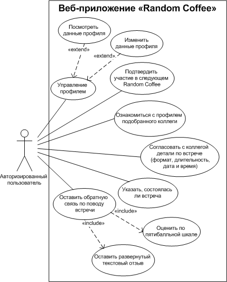

# Описание функциональных возможностей и принципов работы веб-приложения

1. Пользователь
   - [Диаграмма вариантов использования для пользователя (Use case)](#Диаграмма вариантов использования для пользователя)
   - [Подробный User story для пользователя](#Подробный User story для пользователя)
2. Администратор
    - [Диаграмма вариантов использования для администратора (Use case)](#Диаграмма вариантов использования для администратора)
    - [Подробный User story для администратора](#Подробный User story для администратора)
3. [Структура](structure.md)
4. [Deployment](deployment.md)

## Диаграмма вариантов использования для пользователя (Use case)



## Подробный User story для пользователя

1) Сотрудник регистрируется под своим аккаунтом. При регистрации необходимо указать следующие данные:
- ФИО;
- email;
- пароль.

2) После регистрации пользователь не имеет доступа ни к одной странице, пока администратор не подтвердит регистрацию. 
До тех пор пользователь будет видеть сообщение о том, что его учетная запись ожидает подтверждения. Сделано это для 
того, чтобы доступ к системе могли иметь только сотрудники команды. 

3. После подтверждения пользователь получает доступ к странице профиля, на которой отображаются следующие данные: 
- ФИО;
- Дата рождения;
- Специализация (должность); 
- Отдел;
- Username в Telegram;
- Номер телефона;
- О себе.


Пользователь должен указать всю информацию (за исключением ФИО, т.к. оно было указано при регистрации), чтобы получить 
доступ к участию в Random Coffee.

### Чем обусловлено отсутствие чата внутри приложения?
```
Пользователь указывает username в Telegram и номер телефона для связи с коллегой, с которым ему предстоит встретиться. 
Такой выбор обусловлен удобством для коммуникации с коллегами после встреч. Подобные встречи ориентированы на нетворкинг 
и тимбилдинг, поэтому подразумевается, что пользователь скорее всего захочет снова пообщаться с коллегой. В компаниях 
зачастую уже есть один устоявшийся (а то и несколько) корпоративный мессенджер, беседы в публичных мессенджерах и т.п.
для коммуникации сотрудников и нет никакой надобности создавать очередной мессенджер только для того, чтобы общаться там 
по поводу Random Coffee. Наше приложение сфокусировано на решение задачи случайного подбора партнера для встречи.  
```

4) На странице «Актуальная встреча» необходимо подтвердить свое участие в предстоящем Random Coffee нажатием кнопки.

5) Каждый понедельник в 8:00 система автоматически распределяет пользователей, подтвердивших свое участие в Random Coffee, 
по парам. Если участников нечетное количество, то один из них не получит пары и не будет участвовать в Random Coffee на этой недели.

6) После распределения на странице «Актуальная встреча» появится карточка с информацией о случайно подобранном коллеге, 
с котором предстоит пойти на встречу. На странице присутствуют поля для указания формата встречи (онлайн, оффлайн), 
длительности (10, 15, 30 мин), даты и времени. Пользователь указывает свои условия встречи в этих полях и нажимает 
кнопку «Подтвердить». Указанные условия отобразятся у коллеги, с котором предстоит идти на встречу. Он в свою очередь 
указывает свои условия и нажимает кнопку. При полном совпадении встреча становится подтвержденной и считается, что 
коллеги должны пойти на Random Coffee. Если полного совпадения условий так и не произошло до следующего понедельника 
(распределения пар), то встреча так и останется в базе, как не подтвержденная и не проведенная. 

6) После того как согласованная дата встречи истечет, пользователь увидит на странице «Актуальная встреча» сообщение с 
просьбой ответить была проведена встреча или нет (достаточно ответа от одного человека, второй человек не увидит 
просьбы, если его коллега уже даст свой ответ).

7) Если встреча была отмечена как проведенная, оба пользователя должны будут дать обратную связь по встрече: 
оценку по пятибалльной шкале и развернутый текстовый ответ.


